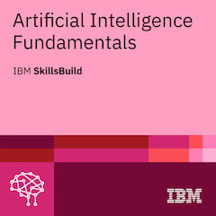
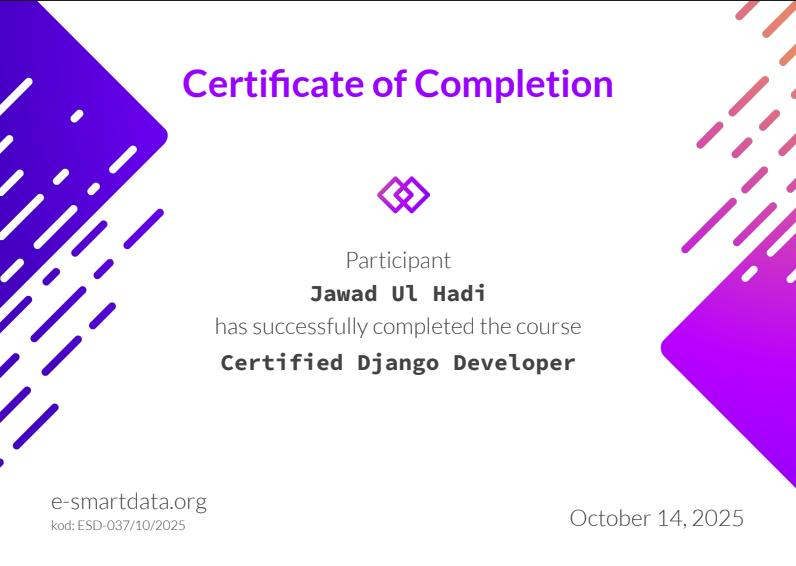
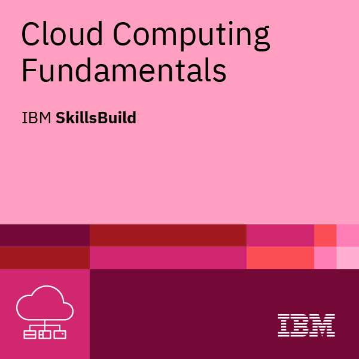
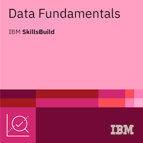
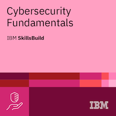
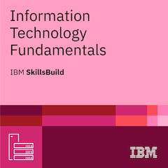
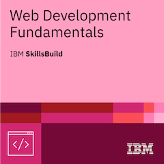
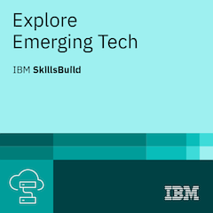
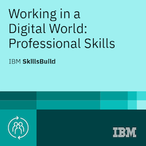

# **Jawad Ul Hadi — Senior Backend Engineer & Solutions Architect**

<p align="center">
  <picture>
    <source media="(prefers-color-scheme: dark)" srcset="banners/repo-banner-dark.png">
    <source media="(prefers-color-scheme: light)" srcset="banners/repo-banner-light.png">
    
  </picture>
</p>

<p align="center">
  <em>"The best code is never rewritten not because it’s perfect, but because it’s flexible enough to evolve with the business"</em>
</p>

<p align="center">
  <a href="https://maps.google.com/?q=Islamabad,Pakistan"></a>
  <a href="mailto:jawadulhadicc@gmail.com"></a>
  <a href="https://wa.me/923467248414"></a>
  <a href="https://linkedin.com/in/jawad-ul-hadi"></a>
  <a href="https://github.com/JawadulHadi"></a>
  <a href="https://jawadulhadi-portfolio.vercel.app"></a>
</p>

<p align="center">
  
  
  
  
  
  
  
  
  
  
  
  
  
</p>

---

## 🎯 Executive Summary & Core Identity

I wear three distinct hats that blend into one seamless skillset:

1. **Senior Software Engineer:** I write production-grade code that scales to hundreds of thousands of users.
2. **Solutions Architect:** I design systems that solve real business problems, not just technical puzzles.
3. **AI/LLM Integrator:** I bridge the gap between cutting-edge AI and practical applications — making LLMs work reliably in production with deterministic fallback guarantees.

With **7+ years** of professional experience spanning multi-tenant SaaS backends (22+ modules), provider-agnostic AI gateways, and high-throughput async processing engines, I don't just build systems — I build intelligent capabilities that enable businesses to scale safely.

---

## 🏛️ Operational Principles & Architecture Philosophy

| Aspect              | Engineering Approach                                                                                                              |
| :-------------------- | :---------------------------------------------------------------------------------------------------------------------------------- |
| **Problem Solving** | Business outcome first, technical implementation second.                                                                          |
| **Architecture**    | Pragmatic, scalable, and customizable. Multi-tenant isolation at database & API layers.                                           |
| **AI Integration**  | Provider-agnostic, resilient, and fallback-ready.**3-Tier Fallback (Retry → RAG → Rule-based)** so AI features never hard-fail. |
| **Code Quality**    | Clean enough to maintain, pragmatic enough to ship. Zero unnecessary rewrite debt.                                                |
| **Team Culture**    | Autonomous, psychologically safe, and knowledge-sharing.                                                                          |
| **Communication**   | Direct, clear, and structured.*(Just call me Bro).*                                                                               |

---

## 🛠️ Technical Competency Stack

### ⚡ Backend & Core Services

- **Languages & Frameworks:** TypeScript, Node.js (v18-v22), NestJS, Python 3.11+, FastAPI, Django, Django REST Framework (DRF), Express.js.
- **Architecture Paradigms:** Multi-Tenant SaaS (Shared DB/Isolated Schema), Event-Driven Architecture, Microservices, RESTful & GraphQL APIs, Domain-Driven Design (DDD).

### 🤖 AI Engineering & LLM Orchestration

- **LLM Integrations:** Google Gemini (1.5 Flash/Pro, Live API, Structured Output), OpenAI (GPT-4o), Anthropic Claude 3.5 Sonnet.
- **Pipelines & Grounding:** RAG (Retrieval-Augmented Generation), Vector Databases (Pinecone, ChromaDB), LangChain, LlamaIndex, Deterministic Rule-Based Fallback Engines.

### 🗄️ Databases & Caching

- **Primary Engines:** PostgreSQL, MySQL, MongoDB, Redis (In-memory caching, Pub/Sub, Rate limiting).
- **Search & Vector:** MeiliSearch, ElasticSearch, pgvector.
- **ORM / ODM:** Prisma, TypeORM, Mongoose, Drizzle.

### ⚙️ Async Queues, DevOps & Cloud

- **Queues & Scheduling:** BullMQ, Celery, Redis Streams, Kafka/RabbitMQ concepts.
- **Cloud Infrastructure:** Google Cloud Platform (Cloud Run, Cloud Build, GCS), AWS (Lambda, ECS, API Gateway, S3, SQS), Azure.
- **DevOps & Containers:** Docker, Docker Compose, GitHub Actions CI/CD, Terraform (IaC).

---

## 🚀 Signature Work & Capability Demonstrations

> 📌 **Note on Confidentiality:** Major enterprise systems (e.g. Talentnix Multi-Tenant ATS with 22 modules, APAC HRMS, iAgility platform) are active in production under private NDA-protected repositories. Live architecture walkthroughs and code samples are available on request.

### Open-Source Developer Suite & Personal Studio builds

| Project                 | Core Capability & Architecture                                                           | Repository                                                     |
| :------------------------ | :----------------------------------------------------------------------------------------- | :--------------------------------------------------------------- |
| **Qeloma Verdict**      | Tamper-evident decision engine with cryptographic audit trails for regulatory compliance | [GitHub ↗](https://github.com/Qeloma/qeloma-verdict)          |
| **Qeloma OCR**          | Client-side hybrid OCR with per-word confidence scoring (Tesseract + Gemini Vision)      | [GitHub ↗](https://github.com/Qeloma/qeloma-ocr)              |
| **Qeloma Lens Studio**  | Multimodal document intelligence & comparative summarization pipeline                    | [GitHub ↗](https://github.com/Qeloma/qeloma_lens_studio)      |
| **Qeloma Voice Studio** | Real-time voice analyst grounded in uploaded enterprise knowledge bases                  | [GitHub ↗](https://github.com/Qeloma/qeloma_voice_studio)     |
| **Qeloma Shift**        | Semantic change-intelligence engine with meaning-level diffing & materiality scoring     | [GitHub ↗](https://github.com/Qeloma/qeloma_shift)            |
| **Qeloma Cover Studio** | Browser-based LinkedIn banner studio with automated AI vector composition                | [GitHub ↗](https://github.com/Qeloma/qeloma-cover-studio)     |
| **Room Booking Engine** | High-concurrency resource management & scheduling backplane                              | [GitHub ↗](https://github.com/Qeloma/qeloma_room_booking_app) |

---

## 📜 26 Verified Certifications

- **Google Cloud:** Generative AI Fundamentals · Cloud Computing Foundations
- **Certified Django Developer:** e-smartdata.org (2025)
- **IBM SkillsBuild (9 Badges):** Artificial Intelligence Fundamentals · Cloud Computing Fundamentals · Cybersecurity Fundamentals · Data Fundamentals · IT Fundamentals · Web Development Fundamentals · Emerging Tech · Professional Skills · Job Application Essentials
- **LinkedIn Learning (15 Badges):** Building Agentic AI with LangChain · Prompt Engineering · Advanced Backend Architecture · AWS Cloud Solutions

<p align="center">
  
  
  
  
  
</p>

<p align="center">
  
  
  
  
</p>

---

## 🐳 Container Packaging & Google Cloud Run Deployment Guide

To achieve 100% uptime with zero cold-start delay, consistent caching, and global edge routing without Vercel's initial loading screen nuances, this application includes an optimized multi-stage `Dockerfile`.

### 1. Local Container Build & Test

```bash
# Clone the repository
git clone https://github.com/JawadulHadi/portfolio.git
cd portfolio

# Build the lightweight production Docker image (~50MB Alpine)
docker build -t jawad-portfolio:latest .

# Run the container locally on port 8080
docker run -d -p 8080:8080 --name jawad-portfolio jawad-portfolio:latest

# Open in browser: http://localhost:8080
```

### 2. Deploy to Google Cloud Run (One-Command via Google Cloud SDK)

Ensure you have the [Google Cloud CLI (`gcloud`)](https://cloud.google.com/sdk) authenticated:

```bash
# Set your active GCP Project
gcloud config set project YOUR_GCP_PROJECT_ID

# Deploy directly from source to Cloud Run
gcloud run deploy jawad-portfolio \
  --source . \
  --region asia-southeast1 \
  --platform managed \
  --allow-unauthenticated \
  --min-instances 1 \
  --memory 256Mi \
  --cpu 1
```

> 💡 **Why Cloud Run with `--min-instances 1`?**
> Setting `min-instances 1` guarantees the container remains warm 24/7, completely eliminating cold-start latency, favicon delivery delays, and intermittent edge loading spinners.

### 3. Automated CI/CD via GitHub Actions (Optional)

Add this workflow to `.github/workflows/deploy-cloud-run.yml`:

```yaml
name: Deploy to Google Cloud Run

on:
  push:
    branches: [ main ]

jobs:
  deploy:
    runs-on: ubuntu-latest
    permissions:
      contents: read
      id-token: write
    steps:
      - uses: actions/checkout@v4

      - name: Authenticate to Google Cloud
        uses: google-github-actions/auth@v2
        with:
          workload_identity_provider: ${{ secrets.GCP_WIF_PROVIDER }}
          service_account: ${{ secrets.GCP_SA_EMAIL }}

      - name: Deploy to Cloud Run
        uses: google-github-actions/deploy-cloudrun@v2
        with:
          service: jawad-portfolio
          region: asia-southeast1
          source: ./
```

---

## 📊 GitHub Analytics

<p align="center">
  
  
</p>

---

## 📬 Connect & Collaborate

- 💼 **LinkedIn:** [linkedin.com/in/jawad-ul-hadi](https://linkedin.com/in/jawad-ul-hadi)
- 🐙 **GitHub:** [github.com/JawadulHadi](https://github.com/JawadulHadi)
- 🌐 **Live Portfolio:** [jawadulhadi-portfolio.vercel.app](https://jawadulhadi-portfolio.vercel.app)
- 📄 **Interactive Résumé:** [jawadulhadi-portfolio.vercel.app/source/resume.html](https://jawadulhadi-portfolio.vercel.app/source/resume.html)
- ✉️ **Direct Email:** [jawadulhadicc@gmail.com](mailto:jawadulhadicc@gmail.com)
- 📱 **WhatsApp / Direct:** [+92 346 7248414](https://wa.me/923467248414)
